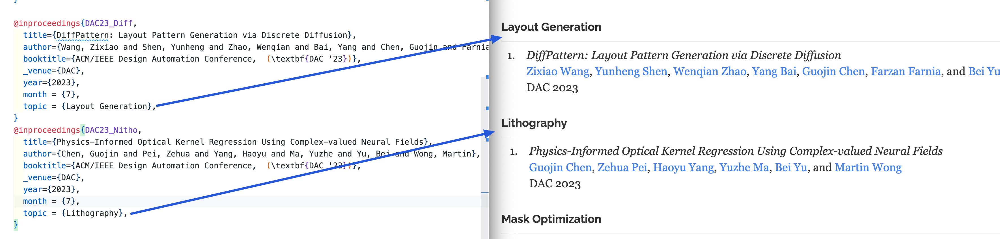

# About

This repo [awesome-AI4EDA](https://github.com/ai4eda/awesome-AI4EDA) contains the source for the webpage: [https://ai4eda.github.io](https://ai4eda.github.io), which is a curated paper list of awesome AI for EDA.

It can **automatically** render the plain `bibtex` file into `html` for display on the webpage.


## Example




## How to contribute / add my publications?

### Step 1: Add your `bibtex` file to `./publications/***.bib`

We provide different categories according to the EDA flow, please copy your bibtex to the corresponding category.

<table>
    <tr>
        <td>Category</td>
        <td>File</td>
        <td>notes</td>
    </tr>
    <tr>
        <td>Architechture Design</td>
        <td>`arch.bib`</td>
        <td></td>
    </tr>
    <tr>
        <td>Placement</td>
        <td>`place.bib`</td>
        <td></td>
    </tr>
    <tr>
        <td>Design for Manufacutring</td>
        <td>`dfm.bib`</td>
        <td></td>
    </tr>
</table>

The categories are defined in `pub.yaml` of repo:[awesome-AI4EDA](https://github.com/ai4eda/awesome-AI4EDA), you can also submit new categories to `pub.yaml` or contact [cgjcuhk@gmail.com](mailto:cgjcuhk@gmail.com) to help you add the categories.

```yaml
# pub.yaml
categories_publications:
  name: "All publications"
  group_by_topic: True
  categories:
    -
      heading: "Architechture Design"
      file: arch.bib
      prefix: ''
    -
      heading: "Placement"
      file: place.bib
      prefix: ''
    -
      heading: "Design for Manufacutring"
      file: dfm.bib
      prefix: ''
```

### Step 2: Add the topic for your pub in the bibtex file.

Example: 👇🏻 the `_venue`, `year`, `topic` fileds are required. You publication will be displayed into the corresponding topic.

You can also add `url` filed to attach the paper link. 
And the `abstract` filed to add the paper abstract.

```bibtex
@inproceedings{DAC23_Nitho,
  title={Physics-Informed Optical Kernel Regression Using Complex-valued Neural Fields},
  author={Chen, Guojin and Pei, Zehua and Yang, Haoyu and Ma, Yuzhe and Yu, Bei and Wong, Martin},
  booktitle={ACM/IEEE Design Automation Conference,  (\textbf{DAC '23})},
  _venue={DAC},
  year={2023},
  topic = {Lithography},
  url = {link to your paper},
  abstract = {abstract of your paper}
}
```

### Step3: Submit a PR or email to Guojin Chen ([cgjcuhk@gmail.com](mailto:cgjcuhk@gmail.com))

Thank you.


## How this work

<details>
<Summary>Toggle to see how this work</Summary>

+ [generate.py](generate.py) creates a [website](http://ai4eda.github.io) from a shared [YAML source](pub.yaml) by using Jinja templates.

+ The publications are rendered from a single
  [BibTeX](publications/all.bib) file.
  The abstracts are displayed in the website output
  and the selected publications here are highlighted.
+ The [YAML source](pub.yaml) links to all author websites,
  which will automatically be added to the
  publication lists in the website and PDF.
+ GitHub stars are automatically scraped and cached on disk.


### Building and running
Dependencies are included in `requirements.txt` and can be installed
using `pip` with `pip3 install -r requirements.txt`.
`make` will call [generate.py](generate.py) and
build the LaTeX documents with `latexmk` and `biber`.
The Makefile can also:

1. Stage to my website with `make stage`,
2. Start a local jekyll server of my website with updated
    documents with `make jekyll`, and
3. Push updated documents to my website with `make push`.

### What to modify
Change the content in `pub.yaml`.
You should also look through the template files to make sure there isn't any
special-case code that needs to be modified.
The `Makefile` can also start a Jekyll server and push the
new documents to another repository with `make jekyll` and `make push`.

</details>

## Warnings
1. Strings in `pub.yaml` should be LaTeX (though, the actual LaTeX formatting
   should be in the left in the templates as much as possible).
2. If you do include any new LaTeX commands, make sure that one of the
   `REPLACEMENTS` in `generate.py` converts them properly.
3. The LaTeX templates use modified Jinja delimiters to avoid overlaps with
   normal LaTeX. See `generate.py` for details.
